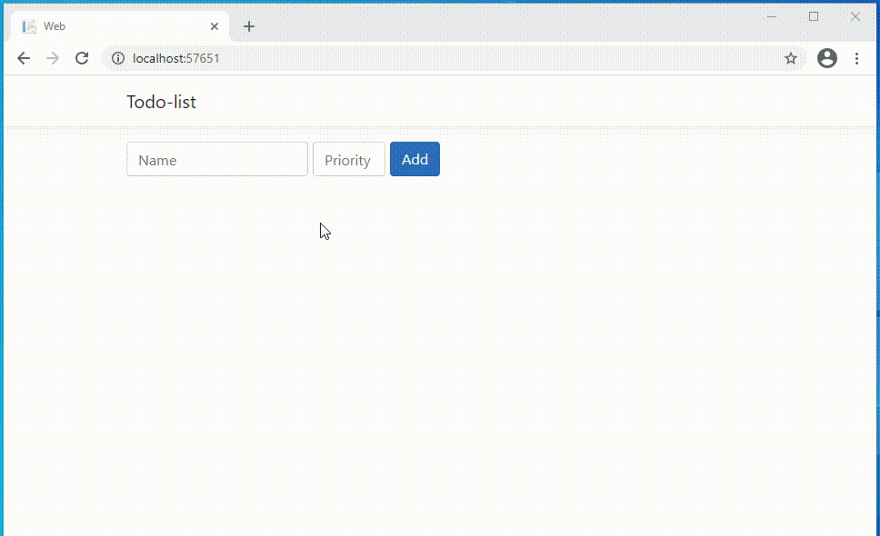

# Tech stack
- Frontend
  - React (v16)
  - Bootstrap (v4.1.3)
  - Node.js (v14.15.4)
  - TypeScript (v3.9.7)
- Backend
  - .NET Core (v3.1) 

# Architecture notes
- Frontend sends API requests
- Backend receives API requests
  - data are stored in singleton in-memory collection database 
  
# REST API

| URL | HTTP method | Operation | On Success | Example call
| ------ | ------ | ------ | ----- | ----- |
| api/tasks | GET | GET all tasks | return task collection (json)  | api/tasks
| api/tasks/{guid} | GET | GET specific task | return task object (json) | api/tasks/184c67fd-cabd-4fd6-ba68-72341226fb19
| api/tasks | POST | ADD | return task object (json) | /api/tasks?name=Foo&priority=1
| api/tasks/{guid} | PUT | UPDATE | return task object (json) | /api/tasks/c11bee0d-5504-4781-8e4b-b7cc2388e9e5?name=Foo&priority=1&status=1
| api/tasks/{guid} | DELETE | DELETE | | api/tasks/184c67fd-cabd-4fd6-ba68-72341226fb19

## HTTP returned task example
One task.
```json
{
    "id": "0ae18821-522e-47b5-80b2-321ed1061543",
    "name": "\"Task One\"",
    "priority": 10,
    "status": 0
}
```

Collection of tasks.
```json
[
    {
        "id": "7ab291be-7918-4d14-acc5-b7a6340c7a74",
        "name": "Bar",
        "priority": 0,
        "status": 0
    },
    {
        "id": "0ae18821-522e-47b5-80b2-321ed1061543",
        "name": "\"Task One\"",
        "priority": 10,
        "status": 0
    }
]
```
## HTTP errors examples

### 404 Not Found
Guid does not exists in in-memory database.
```json
{
    "type": "https://tools.ietf.org/html/rfc7231#section-6.5.4",
    "title": "Not Found",
    "status": 404,
    "traceId": "|b604de90-48e38dcc20fcad48."
}
```


Input arguments does not match API specification.
```json
{
    "type": "https://tools.ietf.org/html/rfc7231#section-6.5.1",
    "title": "One or more validation errors occurred.",
    "status": 400,
    "traceId": "|6ffaf74c-49c3b269fb1e6e96.",
    "errors": {
        "status": [
            "The value 'abc' is not valid."
        ]
    }
}
```

Runtime error.
```
Attempted to divide by zero.
```
Domain validation.
```
Every task must have a name.
```
# Frontend unit tests
Tests are located in **src\Web\ClientApp\src\\_\_tests\_\_** directory.
```sh
src\Web\ClientApp> npm test
```

# Backend unit tests
Tests are located in **Domain.Tests** project.
```sh
project_folder> dotnet test
```

# Demo

